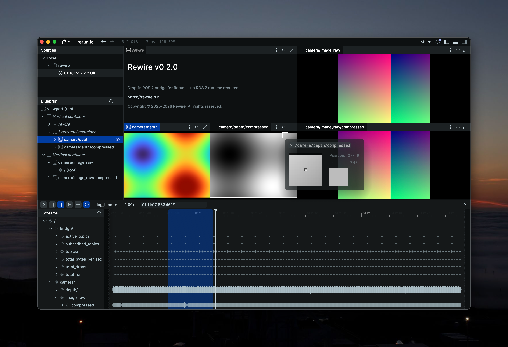

# rewire-camera-example

Synthetic camera publishers for testing [rewire](https://github.com/rewire-run/rewire) image converters.

<div align="center">
  
</div>

## Topics

| Topic | Type | Description |
|---|---|---|
| `/camera/image_raw` | `sensor_msgs/Image` | RGB8 scrolling gradient |
| `/camera/image_raw/compressed` | `sensor_msgs/CompressedImage` | JPEG via `image_transport` |
| `/camera/depth` | `sensor_msgs/Image` | 32FC1 animated sine wave (0.3-10m) |
| `/camera/depth/compressed` | `sensor_msgs/CompressedImage` | PNG-encoded 16UC1 depth |
| `/camera/camera_info` | `sensor_msgs/CameraInfo` | Camera intrinsics |
| `/tf_static` | `tf2_msgs/TFMessage` | Static transform: `map` -> `camera_optical` |

## Setup

Requires [pixi](https://pixi.sh).

```bash
pixi install
```

This project uses [pixi-build-ros](https://github.com/nicross/pixi-build-ros) to build the `rewire_camera` ROS package as a
conda dependency. The `ros-humble-rewire-camera` (or `ros-jazzy-rewire-camera`) package is built from source and installed
into the pixi environment automatically.

## Environments

| Environment | ROS Distro |
|---|---|
| `default` / `humble` | Humble |
| `jazzy` | Jazzy |

## Usage

```bash
pixi run ros2 launch rewire_camera camera.launch.py
```

With custom resolution and frame rate:

```bash
pixi run ros2 launch rewire_camera camera.launch.py width:=1280 height:=720 frequency_hz:=10
```

For the Jazzy environment:

```bash
pixi run -e jazzy ros2 launch rewire_camera camera.launch.py
```

## Development

After modifying the Python nodes in `rewire_camera/`, reinstall the local package:

```bash
pixi reinstall ros-humble-rewire-camera
```

## How it works

The launch file starts three nodes:

- **image_publisher** - publishes synthetic RGB images, camera info, and a static TF (`map` -> `camera_optical`)
- **depth_publisher** - publishes raw 32FC1 depth and a PNG-compressed variant
- **republish** - `image_transport` republish node that produces JPEG from the raw RGB topic

In a separate terminal, run rewire to visualize all topics in Rerun:

```bash
pixi run rewire record --all
```
