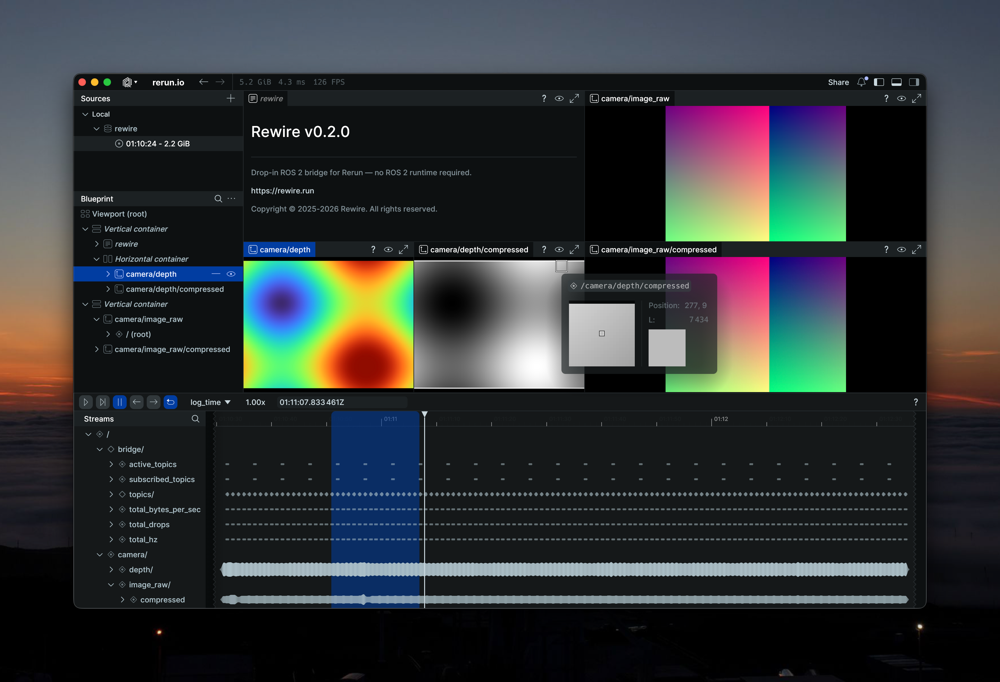

# rewire-camera-example

[](https://pixi.sh)

Synthetic camera publishers for testing [rewire](https://github.com/rewire-run/rewire) image converters.

<div align="center">
  
</div>

## Topics

| Topic | Type | Description |
|---|---|---|
| `/camera/image_raw` | `sensor_msgs/Image` | RGB8 scrolling gradient |
| `/camera/image_raw/compressed` | `sensor_msgs/CompressedImage` | JPEG via `image_transport` |
| `/camera/video` | `sensor_msgs/CompressedImage` | H.264 Annex B stream (`format: "h264"`) |
| `/camera/depth` | `sensor_msgs/Image` | 32FC1 animated sine wave (0.3-10m) |
| `/camera/depth/compressed` | `sensor_msgs/CompressedImage` | PNG-encoded 16UC1 depth |
| `/camera/camera_info` | `sensor_msgs/CameraInfo` | Camera intrinsics |
| `/tf_static` | `tf2_msgs/TFMessage` | Static transform: `map` -> `camera_optical` |

## Setup

Requires [pixi](https://pixi.sh).

```bash
pixi install
```

This project uses [pixi-build-ros](https://github.com/nicross/pixi-build-ros) to build the `rewire_camera` ROS package as a
conda dependency. The `ros-humble-rewire-camera` (or `ros-jazzy-rewire-camera`) package is built from source and installed
into the pixi environment automatically.

## Environments

| Environment | ROS Distro |
|---|---|
| `default` / `humble` | Humble |
| `jazzy` | Jazzy |
| `kilted` | Kilted |
| `lyrical` | Lyrical |

## Usage

```bash
pixi run ros2 launch rewire_camera camera.launch.py
```

With custom resolution and frame rate:

```bash
pixi run ros2 launch rewire_camera camera.launch.py width:=1280 height:=720 frequency_hz:=10
```

For the Jazzy environment:

```bash
pixi run -e jazzy ros2 launch rewire_camera camera.launch.py
```

## Development

After modifying the Python nodes in `rewire_camera/`, reinstall the local package:

```bash
pixi reinstall ros-humble-rewire-camera
```

## How it works

The launch file starts three nodes:

- **image_publisher** - publishes synthetic RGB images, camera info, and a static TF (`map` -> `camera_optical`)
- **depth_publisher** - publishes raw 32FC1 depth and a PNG-compressed variant
- **video_publisher** - encodes the gradient plus a moving white square to H.264 (PyAV/libx264, zerolatency,
  no B-frames, keyframe every 30 frames) and publishes it as `CompressedImage` with `format: "h264"`

In a separate terminal, run rewire to visualize all topics in Rerun:

```bash
pixi run rewire record --all
```

## Testing VideoStream

The bridge maps `CompressedImage` with an `h264`/`h265` format to Rerun's `VideoStream` archetype (rewire
0.7.0 or newer; on older releases build the bridge from source):

```bash
pixi run rewire record --all
```

`/camera/video` appears in the viewer as a decoded video stream instead of individual images. Select the
codec with the `video_codec` launch argument (`h264`, default, or `h265`).

### Native decoding requires FFmpeg

The viewer decodes h264/h265 through the `ffmpeg` executable (5.1 or newer) found on `PATH`. Without it the
stream shows a decoder error.

### Smooth low-latency playback

FFmpeg's default frame threading buffers roughly one frame per CPU core, which adds about half a second of
latency and makes the viewer flash a buffering indicator on machines with many cores. Fix it by pointing the
viewer at a wrapper that enables FFmpeg's low-delay options. Create the wrapper (adjust the FFmpeg path to
`which ffmpeg`):

```bash
printf '#!/bin/sh\nexec /opt/homebrew/bin/ffmpeg -thread_type slice -flags low_delay "$@"\n' > ~/.local/bin/ffmpeg-lowdelay && chmod +x ~/.local/bin/ffmpeg-lowdelay
```

Then in the viewer open **Settings**, enable **Video: override FFmpeg path**, and set it to
`~/.local/bin/ffmpeg-lowdelay` (absolute path). This drops the decoder lag from ~16 frames to ~2 and works for
both codecs. It also applies to video files, where it may slow down timeline scrubbing of high-resolution
recordings; disable the override if that matters more to you.

### H.265 open GOPs need viewer 0.7.0 or newer

Viewers before 0.7.0 (Rerun 0.34) only recognize IDR keyframes, so an h265 stream encoded with open GOPs
(the x265 default) shows nothing for a viewer that joins mid-stream. Rerun 0.35 accepts CRA keyframes too,
so from viewer 0.7.0 onward open GOPs work and `video_publisher` no longer forces `no-open-gop=1`. Two
things still matter for any encoder: repeat the parameter sets on every keyframe (`repeat-headers=1` for
x265), and expect up to one keyframe interval of black after joining mid-stream before the picture appears
(x265 defaults to `keyint=250`). If you must support older viewers, encode with `no-open-gop=1`.
